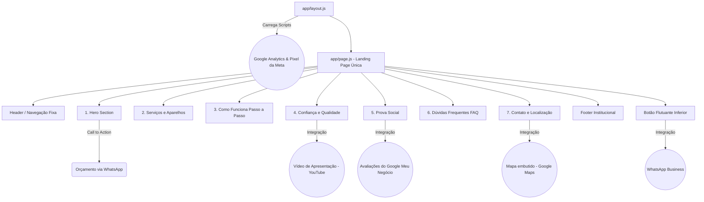

<div align="center">
  
  
  
  
  <br><br>
  <h1>Documentação: IND TEC - Assistência Técnica</h1>
  <p>Landing Page de alta performance focada em conversão e atendimento via WhatsApp</p>
</div>

<hr>

##  Sobre o Projeto

[cite_start]Este repositório contém o código-fonte da Landing Page oficial da **IND TEC Assistência Técnica e Eletrônicos**[cite: 55]. [cite_start]O projeto foi idealizado para o cliente Gabriel [cite: 53][cite_start], proprietário da loja localizada no Jardim dos Oliveiras em Campinas/SP [cite: 96][cite_start], e gerenciado/desenvolvido por Pedro[cite: 146, 169].

[cite_start]O objetivo principal da aplicação é converter o tráfego de visitantes em orçamentos diretos, oferecendo uma interface limpa, moderna e com tom de voz direto[cite: 215, 218]. [cite_start]O site atua como uma vitrine para consertos de celulares, notebooks, computadores e consoles [cite: 84][cite_start], direcionando os usuários rapidamente para o WhatsApp Business da empresa[cite: 128]. [cite_start]A identidade visual explora fielmente as cores da marca: **Verde limão e preto**[cite: 11, 70].

##  Tecnologias e Stack

[cite_start]O desenvolvimento foi guiado pela necessidade de **carregamento extremamente rápido** (foco em velocidade) e suporte contínuo para **acessibilidade técnica**[cite: 292, 295]. 

* [cite_start]**Framework:** Next.js (utilizando App Router e JavaScript puro/sem TypeScript)[cite: 101, 102].
* [cite_start]**Estilização:** Tailwind CSS[cite: 101].
* [cite_start]**Biblioteca de UI:** Shadcn/UI em conjunto com Lucide Icons[cite: 101, 145].
* [cite_start]**Compilador:** React Compiler configurado via `next.config.mjs`[cite: 101, 107].
* [cite_start]**Gerenciador de Pacotes:** `pnpm`[cite: 103, 107].

##  Integrações Estratégicas

[cite_start]A arquitetura do site prevê otimização simultânea para motores de busca padrão (SEO) e motores baseados em Inteligência Artificial para buscas locais (GEO)[cite: 268, 269].

* [cite_start] **Google Maps:** Iframe dinâmico para facilitar a localização da loja física[cite: 124, 125].
* [cite_start] **WhatsApp API:** Botão de contato flutuante com a mensagem pré-definida: *"Olá IND TEC! Quero solicitar um orçamento."*[cite: 128, 129, 130].
* [cite_start] **Google Meu Negócio (Prova Social):** Destaque para a nota 5.0 da empresa, exibindo depoimentos reais de clientes[cite: 122, 123].
* [cite_start] **YouTube Embed:** Vídeo curto na seção de Confiança demonstrando a loja ou a execução de reparos[cite: 119, 120].
* [cite_start] **Rastreamento:** Google Analytics e Pixel da Meta injetados globalmente de forma assíncrona no `layout.js` para não prejudicar a performance[cite: 117, 118].

##  File Tree (Árvore de Arquivos)

[cite_start]A organização das pastas separa as responsabilidades de negócio (Sections) dos blocos de design genéricos (UI)[cite: 103, 104, 105].

<div style="background-color: #1a1a1a; color: #b7df20; padding: 15px; border-radius: 8px; font-family: monospace; line-height: 1.5;">
📦 raiz-do-projeto<br>
 ┣ 📂 .next<br>
 ┣ 📂 app<br>
 ┃ ┣ 📂 components<br>
 ┃ ┃ ┣ 📂 sections<br>
 ┃ ┃ ┃ ┣ 📜 Hero.jsx <i><span style="color:#888;">(Início e Promessa)</span></i><br>
 ┃ ┃ ┃ ┣ 📜 Servicos.jsx <i><span style="color:#888;">(Equipamentos e Marcas)</span></i><br>
 ┃ ┃ ┃ ┣ 📜 ComoFunciona.jsx <i><span style="color:#888;">(Processo de atendimento)</span></i><br>
 ┃ ┃ ┃ ┣ 📜 Confianca.jsx <i><span style="color:#888;">(Vídeo e Galeria)</span></i><br>
 ┃ ┃ ┃ ┣ 📜 Avaliacoes.jsx <i><span style="color:#888;">(Depoimentos)</span></i><br>
 ┃ ┃ ┃ ┣ 📜 Faq.jsx <i><span style="color:#888;">(Dúvidas Frequentes)</span></i><br>
 ┃ ┃ ┃ ┗ 📜 Contato.jsx <i><span style="color:#888;">(Localização)</span></i><br>
 ┃ ┃ ┣ 📂 ui <i><span style="color:#888;">(Shadcn UI Base)</span></i><br>
 ┃ ┃ ┃ ┣ 📜 button.jsx<br>
 ┃ ┃ ┃ ┣ 📜 card.jsx<br>
 ┃ ┃ ┃ ┗ 📜 accordion.jsx<br>
 ┃ ┃ ┗ 📜 WhatsAppButton.jsx <i><span style="color:#888;">(Componente Flutuante)</span></i><br>
 ┃ ┣ 📂 lib<br>
 ┃ ┃ ┗ 📜 utils.js <i><span style="color:#888;">(Utilitários CSS)</span></i><br>
 ┃ ┣ 📜 globals.css <i><span style="color:#888;">(Variáveis Verde e Preto)</span></i><br>
 ┃ ┣ 📜 layout.js <i><span style="color:#888;">(Scripts base, Analytics)</span></i><br>
 ┃ ┗ 📜 page.js <i><span style="color:#888;">(Estruturação da Landing Page)</span></i><br>
 ┣ 📂 public<br>
 ┃ ┣ 📜 logo-ind-tec.png<br>
 ┃ ┣ 📜 foto-equipe.jpg<br>
 ┃ ┗ 📜 foto-loja.jpg<br>
 ┣ 📜 next.config.mjs <i><span style="color:#888;">(Configuração do Compiler)</span></i><br>
 ┗ 📜 package.json<br>
</div>

##  Fluxo e Navegação (Site Map)

[cite_start]O diagrama abaixo detalha a rota de leitura do usuário, orientada à conversão no WhatsApp e interações externas[cite: 108, 109, 114].



##  Como Rodar o Projeto Localmente

1. **Clone este repositório:**
```bash
git clone [https://github.com/seu-usuario/ind-tec-landing-page.git](https://github.com/seu-usuario/ind-tec-landing-page.git)

```


2. **Instale as dependências via PNPM:**
```bash
pnpm install

```


3. **Execute o ambiente de desenvolvimento:**
```bash
pnpm run dev

```


4. **Acesse no navegador:**
Abra `http://localhost:3000` para visualizar a aplicação.