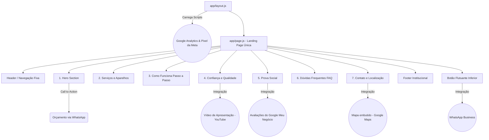

# IND TEC - Assistência Técnica


**Landing Page de alta performance focada em conversão e atendimento via WhatsApp**

---

## 📋 01 – Sobre o Projeto

Este repositório contém o código-fonte da Landing Page oficial da **IND TEC Assistência Técnica e Eletrônicos**. O projeto foi idealizado para o cliente Gabriel, proprietário da loja localizada no Jardim dos Oliveiras em Campinas/SP, e gerenciado/desenvolvido por Pedro.

O objetivo principal da aplicação é **converter o tráfego de visitantes em orçamentos diretos**, oferecendo uma interface limpa, moderna e com tom de voz direto. O site atua como uma vitrine para consertos de celulares, notebooks, computadores e consoles, direcionando os usuários rapidamente para o WhatsApp Business da empresa.

A identidade visual explora fielmente as cores da marca: **Verde limão** e **preto**.

---

## 🛠️ 02 – Tecnologias Utilizadas

O desenvolvimento foi guiado pela necessidade de **carregamento extremamente rápido** (foco em velocidade) e suporte contínuo para **acessibilidade técnica**.

- **Framework:** Next.js (App Router e JavaScript puro, sem TypeScript)
- **Estilização:** Tailwind CSS
- **Biblioteca de UI:** Shadcn/UI em conjunto com Lucide Icons
- **Compilador:** React Compiler configurado via `next.config.mjs`
- **Gerenciador de Pacotes:** `pnpm`

---

## 🔗 03 – Integrações Estratégicas

A arquitetura do site prevê otimização simultânea para motores de busca padrão (SEO) e motores baseados em Inteligência Artificial para buscas locais (GEO).

-  **Google Maps:** Iframe dinâmico para facilitar a localização da loja física.
-  **WhatsApp API:** Botão de contato flutuante com a mensagem pré-definida: *"Olá IND TEC! Quero solicitar um orçamento."*
-  **Google Meu Negócio (Prova Social):** Destaque para a nota 5.0 da empresa, exibindo depoimentos reais de clientes.
-  **YouTube Embed:** Vídeo curto na seção de Confiança demonstrando a loja ou a execução de reparos.
-  **Rastreamento:** Google Analytics e Pixel da Meta injetados globalmente de forma assíncrona no `layout.js` para não prejudicar a performance.

---

## 📁 04 – Estrutura do Projeto

A organização das pastas separa as responsabilidades de negócio (Sections) dos blocos de design genéricos (UI).

```
📦 raiz-do-projeto
┣ 📂 .next
┣ 📂 app
┃ ┣ 📂 components
┃ ┃ ┣ 📂 sections
┃ ┃ ┃ ┣ 📜 Hero.jsx               (Início e Promessa)
┃ ┃ ┃ ┣ 📜 Servicos.jsx            (Equipamentos e Marcas)
┃ ┃ ┃ ┣ 📜 ComoFunciona.jsx        (Processo de atendimento)
┃ ┃ ┃ ┣ 📜 Confianca.jsx           (Vídeo e Galeria)
┃ ┃ ┃ ┣ 📜 Avaliacoes.jsx          (Depoimentos)
┃ ┃ ┃ ┣ 📜 Faq.jsx                 (Dúvidas Frequentes)
┃ ┃ ┃ ┗ 📜 Contato.jsx             (Localização)
┃ ┃ ┣ 📂 ui                         (Shadcn UI Base)
┃ ┃ ┃ ┣ 📜 button.jsx
┃ ┃ ┃ ┣ 📜 card.jsx
┃ ┃ ┃ ┗ 📜 accordion.jsx
┃ ┃ ┗ 📜 WhatsAppButton.jsx        (Componente Flutuante)
┃ ┣ 📂 lib
┃ ┃ ┗ 📜 utils.js                  (Utilitários CSS)
┃ ┣ 📜 globals.css                 (Variáveis Verde e Preto)
┃ ┣ 📜 layout.js                   (Scripts base, Analytics)
┃ ┗ 📜 page.js                     (Estruturação da Landing Page)
┣ 📂 public
┃ ┣ 📜 logo-ind-tec.png
┃ ┣ 📜 foto-equipe.jpg
┃ ┗ 📜 foto-loja.jpg
┣ 📜 next.config.mjs               (Configuração do Compiler)
┣ 📜 package.json
┣ 📜 LICENSE.md                    (Licença do projeto)
┗ 📜 SECURITY.md                   (Políticas de segurança)
```

---

## 🗺️ 05 – Mapa do Site (Fluxo e Navegação)

O diagrama abaixo detalha a rota de leitura do usuário, orientada à conversão no WhatsApp e interações externas.



---

## 💻 06 – Instalação e Uso

1. **Clone este repositório:**
   ```bash
   git clone https://github.com/seu-usuario/ind-tec-landing-page.git
   ```

2. **Instale as dependências via PNPM:**
   ```bash
   pnpm install
   ```

3. **Execute o ambiente de desenvolvimento:**
   ```bash
   pnpm run dev
   ```

4. **Acesse no navegador:**  
   Abra `http://localhost:3000` para visualizar a aplicação.

---

## 🤝 07 – Como Contribuir

Este projeto foi desenvolvido para atender às necessidades específicas da **IND TEC Assistência Técnica**, mas caso deseje contribuir com melhorias na estrutura ou performance:

1. Faça um Fork do projeto.
2. Crie uma branch para sua feature (`git checkout -b feature/MinhaFeature`).
3. Faça o commit das suas alterações (`git commit -m 'feat: Adicionando nova feature'`).
4. Faça o push para a branch (`git push origin feature/MinhaFeature`).
5. Abra um Pull Request detalhando as alterações propostas.

---

## ⚖️ 08 – Licença e Direitos

- **Direitos Autorais:** © 2026 IND TEC Assistência Técnica e Eletrônicos. Todos os direitos reservados à marca IND TEC. Desenvolvido e gerenciado por Pedro.
- **Segurança:** Para reportar vulnerabilidades, consulte as diretrizes no arquivo `SECURITY.md`.
- **Licença:** Distribuído sob a licença MIT. Veja o arquivo `LICENSE.md` para mais informações.