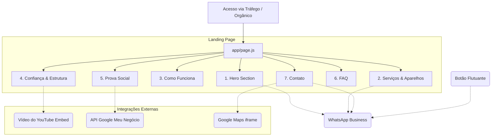

  
  
  
  
    
  <h1>Documentação Oficial: IND TEC</h1>
  
Planejamento Estrutural, Conteúdo e Integrações da Landing Page

<h2> Árvore de Arquivos (File Tree)</h2>

Arquitetura otimizada para o <b>Next.js</b> (JavaScript), com pastas para componentes do <b>Shadcn UI</b> e divisões semânticas por seções da página.

📦 ind-tec-landing-page 
 ┣ 📂 .next 
 ┣ 📂 app 
 ┃ ┣ 📂 components 
 ┃ ┃ ┣ 📂 sections 
 ┃ ┃ ┃ ┣ 📜 Hero.jsx <i>(Início e CTA)</i> 
 ┃ ┃ ┃ ┣ 📜 Servicos.jsx <i>(Lista de equipamentos)</i> 
 ┃ ┃ ┃ ┣ 📜 ComoFunciona.jsx <i>(Passo a passo)</i> 
 ┃ ┃ ┃ ┣ 📜 Confianca.jsx <i>(Galeria e Vídeo YouTube)</i> 
 ┃ ┃ ┃ ┣ 📜 Avaliacoes.jsx <i>(Depoimentos Google)</i> 
 ┃ ┃ ┃ ┣ 📜 Faq.jsx <i>(Dúvidas frequentes)</i> 
 ┃ ┃ ┃ ┗ 📜 Contato.jsx <i>(Endereço e Maps)</i> 
 ┃ ┃ ┣ 📂 ui <i>(Componentes Shadcn)</i> 
 ┃ ┃ ┃ ┣ 📜 button.jsx 
 ┃ ┃ ┃ ┣ 📜 card.jsx 
 ┃ ┃ ┃ ┗ 📜 accordion.jsx 
 ┃ ┃ ┗ 📜 WhatsAppButton.jsx <i>(Botão flutuante)</i> 
 ┃ ┣ 📂 lib 
 ┃ ┃ ┗ 📜 utils.js <i>(Tailwind merge)</i> 
 ┃ ┣ 📜 favicon.ico 
 ┃ ┣ 📜 globals.css <i>(Variáveis Verde Limão e Preto)</i> 
 ┃ ┣ 📜 layout.js <i>(Tags SEO, Google Analytics, Pixel)</i> 
 ┃ ┗ 📜 page.js <i>(Página principal agregadora)</i> 
 ┣ 📂 public 
 ┃ ┣ 📜 logo-ind-tec.png 
 ┃ ┣ 📜 foto-equipe.jpg 
 ┃ ┗ 📜 foto-loja.jpg 
 ┣ 📜 components.json <i>(Configuração Shadcn)</i> 
 ┣ 📜 next.config.mjs <i>(React Compiler config)</i> 
 ┗ 📜 package.json 

 

<h2> Mapa do Site e Fluxo (Site Map)</h2>

 

<h2> Textos e Seções (Copywriting)</h2>

Os textos foram reescritos para transmitir uma comunicação direta, com as palavras-chave adequadas para a marca.

  
1. Hero Section (Início)

  

    
<b>Título:</b> Seu equipamento parou? A IND TEC resolve.

    
<b>Subtítulo:</b> Celulares, notebooks, computadores e consoles. Atendimento técnico, diagnóstico e reparos em um só lugar.

    
<b>Prova Social:</b> ⭐ 5,0 no Google com 83 avaliações

    
<b>Botão Ação (CTA):</b> Solicitar orçamento

  

  
2. Serviços Especializados

  

    
<b>Título da Seção:</b> O que precisa de reparo?

    <ul style="list-style-type: none; padding-left: 0;">
      <li>📱 <b>Celulares:</b> Troca de tela, bateria, conector de carga, placa e manutenção. Todas as marcas.</li>
      <li>💻 <b>Notebooks:</b> Troca de tela, SSD, memória RAM, limpeza e diagnóstico.</li>
      <li>🖥️ <b>Computadores:</b> Manutenção, upgrades, montagem e diagnóstico.</li>
      <li>🎮 <b>Consoles:</b> Manutenção e diagnóstico de videogames.</li>
      <li>🔄 <b>Seminovos:</b> Venda de aparelhos com procedência e garantia.</li>
    </ul>
  

  
3. Como Funciona (Processo)

  

    
<b>Título da Seção:</b> Do problema à solução.

    <ol>
      <li><b>Conte o problema:</b> Envie o aparelho, modelo e o que aconteceu pelo WhatsApp.</li>
      <li><b>Receba orientação:</b> Nossa equipe analisa as informações e orienta o próximo passo.</li>
      <li><b>Aprove o serviço:</b> Após o diagnóstico e orçamento, seguimos com o reparo autorizado.</li>
    </ol>
  

  
4. Confiança e Qualidade

  

    
<b>Conteúdo Visual:</b>

    <ul>
      <li>Galeria de fotos (Loja, fachada e equipe técnica).</li>
      <li>Carrossel de imagens "Antes e Depois" dos aparelhos consertados.</li>
      <li>Espaço para Vídeo Institucional ou demostração de reparo.</li>
      <li><b>Destaque em Texto:</b> Garantia de 90 dias a até 1 ano nos serviços e peças!</li>
    </ul>
  

  
5. Dúvidas Frequentes (FAQ)

  

    
<b>P: Fazem manutenção em celulares?</b> 
    R: Claro, me informe o modelo e o problema que seu aparelho está apresentando.

    
<b>P: Fazem montagem de computadores?</b> 
    R: Fazemos sim, você já tem as peças ou gostaria de um orçamento de um novo!

  

  
6. Contato, Localização e Footer

  

    
<b>Localização:</b> Av. Jorge Tibiriçá, 1050 - Jardim dos Oliveiras — Campinas/SP

    
<b>Horários:</b> Segunda a sexta das 09h às 18h | Sábado das 08h às 13h

    
<b>Pagamento:</b> Débito, crédito, dinheiro, Pix.

    
<b>Footer:</b> IND TEC — Assistência Técnica e Eletrônicos, © 2026 • Campinas/SP

  

 

<h2> Especificação Técnica de Integrações</h2>

Listagem de como as APIs e Widgets de terceiros serão acoplados ao código Next.js.

<table style="width: 100%; border-collapse: collapse; font-family: sans-serif;">
  <thead>
    <tr style="background-color: #111; color: #b7df20;">
      <th style="padding: 12px; border: 1px solid #333;">Serviço</th>
      <th style="padding: 12px; border: 1px solid #333;">Implementação Técnica</th>
    </tr>
  </thead>
  <tbody>
    <tr>
      <td style="padding: 12px; border: 1px solid #ddd; text-align: center;">
          
        <code>Contato.jsx</code>
      </td>
      <td style="padding: 12px; border: 1px solid #ddd; color: #333;">
        <b>Iframe Dinâmico:</b> Inserção da tag <code>&lt;iframe&gt;</code> nativa do Maps apontando para as coordenadas da loja física. <code>loading="lazy"</code> habilitado para não prejudicar o React Compiler.
      </td>
    </tr>
    <tr style="background-color: #f9f9f9;">
      <td style="padding: 12px; border: 1px solid #ddd; text-align: center;">
          
        <code>WhatsAppButton.jsx</code>
      </td>
      <td style="padding: 12px; border: 1px solid #ddd; color: #333;">
        <b>Link Parametrizado (API):</b> Uso da URL base <code>https://wa.me/5519953243237?text=Olá IND TEC! Quero solicitar um orçamento.</code> Componente flutuante fixo no canto inferior com CSS <code>fixed bottom-4 right-4 z-50</code>.
      </td>
    </tr>
    <tr>
      <td style="padding: 12px; border: 1px solid #ddd; text-align: center;">
          
        <code>Avaliacoes.jsx</code>
      </td>
      <td style="padding: 12px; border: 1px solid #ddd; color: #333;">
        <b>Widget ou Hardcoded:</b> Os 5 depoimentos extraídos do protótipo e a nota 5.0 serão estilizados com o componente <code>Card</code> do Shadcn. Pode ser acoplado um widget Elfsight no futuro.
      </td>
    </tr>
    <tr style="background-color: #f9f9f9;">
      <td style="padding: 12px; border: 1px solid #ddd; text-align: center;">
          
        <code>Confianca.jsx</code>
      </td>
      <td style="padding: 12px; border: 1px solid #ddd; color: #333;">
        <b>Video Container:</b> <code>&lt;iframe&gt;</code> embutido no padrão 16:9 <code>aspect-video</code> do Tailwind. Vídeo curto hospedado no canal da assistência.
      </td>
    </tr>
    <tr>
      <td style="padding: 12px; border: 1px solid #ddd; text-align: center;">
         
          
        <code>layout.js</code>
      </td>
      <td style="padding: 12px; border: 1px solid #ddd; color: #333;">
        <b>Rastreamento Global:</b> Inserção dos scripts de tracking (Google Analytics e Pixel Meta) usando a tag <code>&lt;Script strategy="afterInteractive" /&gt;</code> do Next.js para manter alta performance de carregamento.
      </td>
    </tr>
  </tbody>
</table>